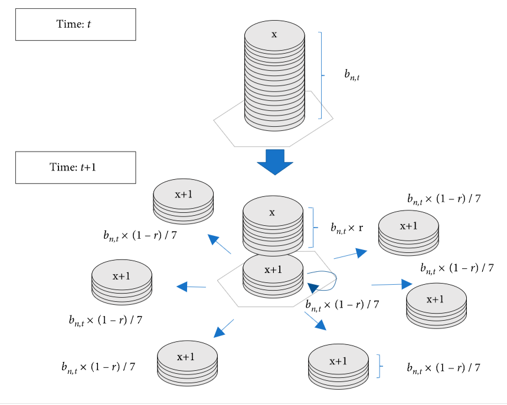

# Grid Effects on Turing Patterns in Cellular Automata-Like Models 

Ally Bell and Yehya Albarkri

## Abstract

We are exploring the effects of grid shape on the Turing Patterns that emerge in CA models, particularly based on a model that passes "tokens" between spaces on a hexagonal grid. At this point in our implementation, we've compared the behavior of a square grid to a hexagonal grid in a traditional reaction-diffusion model, without the token implementation used in the Ishida paper. We've observed a distinct difference, and so are moving forward with investigating this modification. 

## Annotated Bibliography

Emergence of Turing Patterns in a Simple Cellular Automata-Like Model via Exchange of Integer Values between Adjacent Cells

Ishida, Takeshi, Hindawi Discrete Dynamics in Nature and Society (January 28, 2020)

This paper presents a CA-like model of a simplified Turning pattern model which can produce the characteristic spots and stripes while also being able to support Turing instability. On a hexagonal grid, the model employs a different approach to pattern formation that uses only one type of token. Cells exchange integer values with only adjacent cells, and tokens increase in value as they move. Some token movement is determined by the global algorithm rather than the local, differentiating the model from a typical CA structure. Ishida proposes the application of this model to IOT devices to control data traffic.

## Experiment

Ishida models diffusion reactions on a hexagonal grid, where tokens are passed between cells to create Turing patterns.

He explains the choice of a hexagonal grid due to the follow reasons:

"(a) In a square grid, the subsequent cell state is based on the states of the considered cell and its eight neighbors. There are only six neighbors in a hexagonal grid, which simplifies the number of transition rules to be considered.

(b) A hexagonal grid is isotropic, whereas a square grid is not. Since this model includes the process of distributing tokens to adjacent cells, it is simpler to apply when the distances between adjacent cells are equal. This model can also be applied to a square grid, but the pattern that is created is not isotropic. Many previous studies, such as those by Adamatzky [26] and Schepers [22] used isotropic grids."

We're exploring this choice - investigating what effects a different grid shape will have on the emerging patterns and how this compares to the results Ishida arrived at. 

In the Ishida Model, there are two possible states a cell can be in (black and white), and each cell can contain tokens that are labeled with integer values and passed between cells. Each time a token moves, it's value increases by one, as seen in the figure below.

The black cells act as sources for tokens, with *b* initial tokens on a black cell at each time step. At each time step, the tokens are distributed. The residual token ratio *r* is the fraction of unmoved tokens in each cell. Where *b(n,t)* is the numbers of tokens in cell *n* at time *t*, *b(n,t)* x (1 - *r*) x 6/7 of the tokens diffuse towards the six adjacent cells evenly. The remaining proportion, *b(n,t)* x (1 - *r*) x 1/7 are incremented by one, despite not moving. The residual *b(n,t)* x *r* remain unchanged in the cell, as shown in the Figure below. If the number of tokens is not an integer multiple of 7, the remainder of the tokens are distributed with equal probability. The incremental labeling in each timestep is repeated until the maximum number *X* is reached. If there are fewer than *b(n,t)* x *d* tokens in a cell, where *d* is dissipation rate, those tokens are removed from the cell. After the movement of tokens at each time step, the state of each cell for the next step is determined by the fraction of "younger" tokens that it contains. The ratio of the number of tokens labeled equal or less than *X* / 2 is used to determine the subsequent cell state. 

We're implementing our variation on the model using a square grid, where tokens spread to the neighboring eight cells rather than six, as in the hexagonal. We will also try a third approach, in which tokens are spread to the neighboring four cells directly adjacent. 

## Results

There are two key modifications in our implementation from a standard reaction-diffusion model. The first is that we are using a hexagonal grid, rather than a rectangular. The second is the use of token model outlined above. As a consequence of this, we will have parameters that a standard reaction-diffusion model does not, and potentially be able to observe a different range of behaviors modifying these variables.

One possible manner we can display the results of our two models is through a grid of examples. We can show a row of a variety of tunings for the shared parameters between the models. For the additional parameters, we can provide examples of the new model as columns below the rows. This would create a visually interpretable breakdown of the differences between the models.

We have a diffusion-reaction model implementation of a hexagonal grid and a rectangular grid, and have found that the results in these models vary quite a bit. However, we are still in the process of implementing the token function that is described in the paper. We're excited to see what results our implementation of it yields.

The following images are of the following parameters: a grid size of 300 x 300, diffusion rate a: 0.5, diffusion rate b: 0.25, feed rate 0.02, kill rate: 0.05, and starting noise with the range of 0 - 0.1. 

The image above displays the results using a rectangular grid, where the chemical diffuses equally in all 4 directions.

The image above displays the results using a hexagonal grid, there the chemical diffuses equally in all 6 directions.

As you can see, the results are quite different, and both are interesting in their own way. We look forward to completing Ishida's model to view the results of a different abstraction of reaction-diffusion.

## Next Steps

Our biggest hurdle going forward is going to be completing the logic for passing tokens. We're planning on sitting down and talking through how to model this. Once we have established this model, we will be able to play around with the parameters used, and see how well we can recreate the results Ishida got. We will also then be able to modify and apply the varying grid shapes that we plan on exploring. 

From this, we'll be able to see, quantitatively, the differences between grid shapes with a range of parameters. We'd like to see how we can compare them quantitatively, which was discussed in other papers we read, but not directly in Ishida's. Were interested in further exploring the implications of Ishida's model, and its possible applications. He suggests several applications in the paper, and we want to explore how these applications apply to our grid version of his model.
