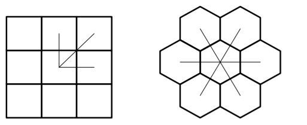
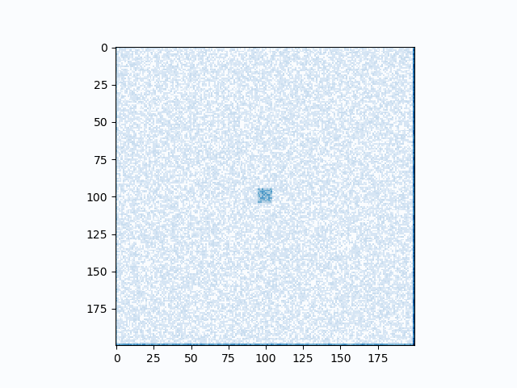
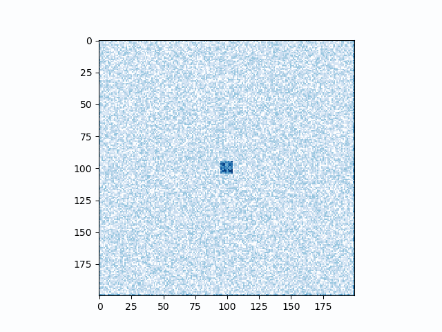
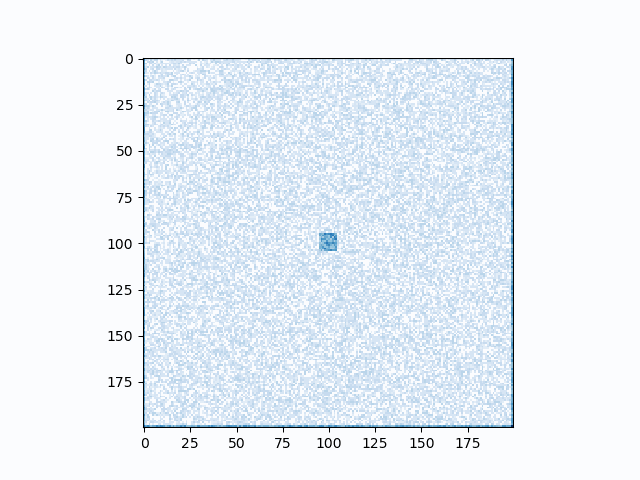
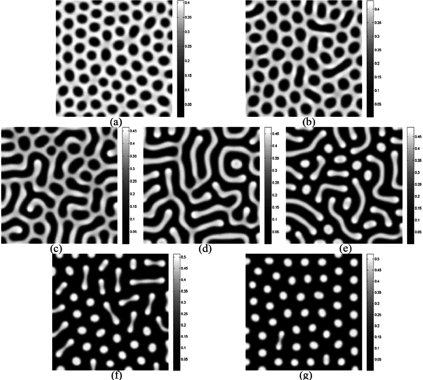

# Grid Shape Effects on Turing Patterns in Cellular Automata-Like Models

Ally Bell and Yehya Albarkri

## Abstract

We are exploring the effects of grid shape on the Turing Patterns that emerge in CA models. We have chosen to compare rectangular and hexagonal grids, which are isometric and non-isometric, respectively. Both of these grid shapes can produce Turing-like patterns, and are both common choices in the literature for modeling these systems. We have previously experimented with rectangular grid patterns, and have found that with some parameters, they can mimic patterns found in nature. We wanted to know if simulating a hexagonal grid would yield similar results to those of a rectangular grid, or mimic another natural phenomenon (potentially fluids since they have isometric interactions), or if the results are random / incomprehensible. We are interested in the impact of this decision, and potential advantages and disadvantages of each.

To explore these two approaches, we built off of a standard reaction-diffusion model, as seen in "Think Complexity". We started with the given set of parameters that defined a critical state in the reaction-diffusion model in a rectangular grid. We observed the results of each set of parameters in rectangular and hexagonal grids to observe differences in their behavior. We varied these parameters until we observed interesting or critical behavior in either or both of the two models. An animation of the growth of the models was then recorded for further analysis and comparison. 

## Background

Alan Turing first described the behavior that produces the patterns appearing in reaction diffusion systems in his 1952 paper “The chemical basis of morphogenesis”. As summarized in Think Complexity, “these systems produce a wide range of patterns, depending on the diffusion and reaction rates, and [Turing] conjectured that systems like this might be an important mechanism in biological growth processes, particularly the development of animal coloration patterns.” They have, in fact, been shown to have appear in places such as skin pigmentation and chick embryos.

Many different types of CA models attempt to replicate these patterns. In the paper we investigated, "Emergence of Turing Patterns in a Simple Cellular Automata-Like Model via Exchange of Integer Values between Adjacent Cells", Ishida models diffusion reactions on a hexagonal grid, where tokens are passed between cells to create Turing patterns. He explains the choice of a hexagonal grid due to the follow reasons:

"(a) In a square grid, the subsequent cell state is based on the states of the considered cell and its eight neighbors. There are only six neighbors in a hexagonal grid, which simplifies the number of transition rules to be considered.

(b) A hexagonal grid is isotropic, whereas a square grid is not. Since this model includes the process of distributing tokens to adjacent cells, it is simpler to apply when the distances between adjacent cells are equal. This model can also be applied to a square grid, but the pattern that is created is not isotropic. Many previous studies, such as those by Adamatzky [26] and Schepers [22] used isotropic grids."

We're exploring this choice - investigating what effects a different grid shape have on the emerging patterns and how this compares to the results Ishida arrived at. One of Ishida's points focuses on how hexagonal grids are isotropic, and square grids are not, as shown in the figure below. 

His other explanation of reasoning is also based on cell neighborhoods, and a hexagonal grid allows for the simplification of that. 

## Experiment and Results

In order to isolate the factor we wanted to explore, grid shape, we kept our model simple. This model follows the approach outlined in Think Complexity for single chemical diffusion, a CA where each cell has a continuous quantity between 1 and 0 representing the chemical. The diffusion process takes place by comparing each cell in the grid to its neighbors. If the concentration of the cell exceeds the surrounding average, its concentration is distributed to the neighboring cells. If the surrounding average is higher than the concentration in the cell, chemical moves into that cell.

Our key modification from a standard reaction-diffusion model is that we are now using hexagonal grids, which offer the property of being isotropic. There are a few important pieces of information to note. First, we do not know if the critical behavior for a rectangular grid occurs at the same set of parameters as a hexagonal grid. Also, because the search space is so vast, it is difficult to explore much of the parameter space to get a very deep understanding of the behaviors of the two models. Finally, all the plots are on a 200 by 200 pixel grid, this was chosen so that the models can be computed within a reasonable amount of time. This does offer a restraint for edge behavior, which may be visually impeding the actual behavior of the models.

Below are some animations of hexagonal (left) and rectangular (right) plots of each model with various sets of parameters. There are a few observable patterns across all sets of parameters. First, all the hexagonal examples settle into the same pattern. They tend to have interesting behavior, and seeds spawn at different locations, but they all settle into a stripy pattern. They also all tend to resemble wave-like behavior. With the same sets of parameters, the models using the rectangular grid offer a greater variety of patterns once settled, with the second  and third examples appearing to be in a perpetual state of motion. 

  
   

Parameters: diff_rate_a=0.5, diff_rate_b=0.25, feed_rate=0.035, kill_rate=0.057
#

  
   

Parameters: diff_rate_a=0.2, diff_rate_b=0.1, feed_rate=0.015, kill_rate=0.05
#

  
   

Parameters: diff_rate_a=0.15, diff_rate_b=0.1, feed_rate=0.02, kill_rate=0.05
#

  
   

Parameters: diff_rate_a=0.5, diff_rate_b=0.1, feed_rate=0.02, kill_rate=0.05
#

  
   

Parameters: diff_rate_a=0.5, diff_rate_b=0.1, feed_rate=0.04, kill_rate=0.05
  

### Explanation of Parameters

Some default parameters are also uniform across all tests to reduce the search space. These are: island_dim=10, noise=0.1, steps=15000. island_dim creates an island in the center of the grid of dimension n by n with a higher concentration than the rest of the grid. The default it increases the height by is 0.1. noise is a coefficient that is multiplied by a random value between 0 and 1 for each square in the grid. steps is the number of steps in each animation (how long the model runs for). diff_rate_a is the rate at which chemical A diffuses into the surrounding cells. diff_rate_b is the rate at which chemical B diffuses into the surrounding cells. feed_rate is the rate at which chemical A increases and kill_rate is the rate at which chemical B (which feeds off chemical A) is killed off.

#

## Analysis

In the results produced, we don't see as distinct of patterns emerge in the hexagonal grids. We instead see series of lines emerging, forming from crescent like shapes that grow and move only in one direction. This distinctly does not match the animal like patterns that emerge in our square grid models, as seen in classical Turing pattern examples, as shown below.

In contrast to this, almost all examples of Turing patterns in nature emerge in isometric grids, as takes place in hexagonal models. Cells form in in hexagonal patterns, each in contact with six others. Here, we see an example of hexagonal grids in the cells of onion cells and plant cells.

  
   

The wave-like pattern seen in the hexagonal models may mimic biological mechanisms on different scales - for example the growth pattern in multicellular organisms. Below, we see the growth of a fungi under bioluminescence. Here, we see waves of growth moving outwards repeatedly, similar to the ones produced in our hexagonal models.

It is also known that neurons fire neurons in hexagonal patterns, which has been proposed to be an example of a Turning pattern (Monsalve-Mercado).

Although it is not clear which of these grid shapes is a better biological model, and both can be used in diffusion reactions, they each have several main advantages and draw backs. It is also possible that they are both good models, just of different biological systems. As we've seen, hexagonal grids have entirely identical neighbors, that each are the same distance away and share the same side length. In contrast, square grids have different types of relationships to their neighbors, but there is an ease of definition and storage of data by comparison. They each have very distinct behaviors, and massively affect the understanding that a model can be striving to answer. Considering your model in a square or hexagonal grid, or even testing this out, makes a lot of sense. Although from looking at other research, it is apparent that a wider range of Turing patterns than what we saw can emerge from hexagonal grids. With the parameters we used, we reached a steady state in the same way for every test, just at different speeds and emergent patterns. 

We've shown that the decision to use a hexagonal or rectangular grid massively impacts the results put out by a model, and this choice is very commonly just accepted as preference in the literature when perhaps it should really be treated more like a parameter, and the results of each compared.

## Bibliography

Ishida, Takeshi. January 2020. Emergence of Turing Patterns in a Simple Cellular Automata-Like Model via Exchange of Integer Values between Adjacent Cells, Hindawi. 

Xiaofang Zhai, Xinyan Xhu, Zhi Xiao, Feng Weng. 2009. Research on the Comparison of Extension Mechanism of Cellular Automaton Based on Hexagon Grid and Rectangular Grid

## Video and Image Sources
https://www.sciencephoto.com/media/445142/view/lm-of-onion-skin

https://www.nationalgeographic.org/encyclopedia/chlorophyll/

https://www.youtube.com/watch?v=i9T727tz7FA