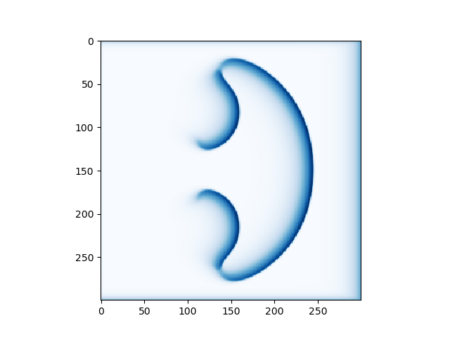

# Grid Shape Effects on Turing Patterns in Cellular Automata-Like Models

Ally Bell and Yehya Albarkri

## Abstract

We are exploring the effects of grid shape on the Turing Patterns that emerge in CA models. We have chosen to compare rectangular and hexagonal grids, which are isometric and non-isometric, respectively. Both of these grid shapes can produce Turing-like patterns, and are both common choices in the literature for modeling these systems. We have previously experimented with rectangular grid patterns, and have found that with some parameters, they can mimic patterns found in nature. We wanted to know if simulating a hexagonal grid would yield similar results to those of a rectangular grid, or mimic another natural phenomenon (potentially fluids since they have isometric interactions), or if the results are random / incomprehensible. We are interested in the impact of this decision, and potential advantages and disadvantages of each.

To explore these two approaches, we built off of a standard reaction-diffusion model, as seen in "Think Complexity". We started with the given set of parameters that defined a critical state in the reaction-diffusion model in a rectangular grid. We observed the results of each set of parameters in rectangular and hexagonal grids to observe differences in their behavior. We varied these parameters until we observed interesting or critical behavior in either or both of the two models. An animation of the growth of the models was then recorded for further analysis and comparison. 

## Background

Alan Turnng first described the behavior that produces the patterns appearing in reaction diffusion systems in his 1952 paper “The chemical basis of morphogenesis”. As summarized in Think Complexity, “these systems produce a wide range of patterns, depending on the diffusion and reaction rates, and [Turing] conjectured that systems like this might be an important mechanism in biological growth processes, particularly the development of animal coloration patterns.” They have, in fact, been shown to ___

Many different types of CA models attempt to replicate these patterns. ___ . Ishida models diffusion reactions on a hexagonal grid, where tokens are passed between cells to create Turing patterns. He explains the choice of a hexagonal grid due to the follow reasons:

"(a) In a square grid, the subsequent cell state is based on the states of the considered cell and its eight neighbors. There are only six neighbors in a hexagonal grid, which simplifies the number of transition rules to be considered.
(b) A hexagonal grid is isotropic, whereas a square grid is not. Since this model includes the process of distributing tokens to adjacent cells, it is simpler to apply when the distances between adjacent cells are equal. This model can also be applied to a square grid, but the pattern that is created is not isotropic. Many previous studies, such as those by Adamatzky [26] and Schepers [22] used isotropic grids."

We're exploring this choice - investigating what effects a different grid shape will have on the emerging patterns and how this compares to the results Ishida arrived at. 

## Experiment

In order to isolate the factor we wanted to explore, grid shape, we kept our model simple. This model follows the approach outlined in Think Complexity for single chemical diffusion, a CA where each cell has a continuous quantity between 1 and 0 representing the chemical. The diffusion process takes place by comparing each cell in the grid to its neighbors. If the concentration of the cell exceeds the surrounding average, its concentration is distributed to the neighboring cells. If the surrounding average is higher than the concentration in the cell, chemical moves into that cell.

  
   
  

