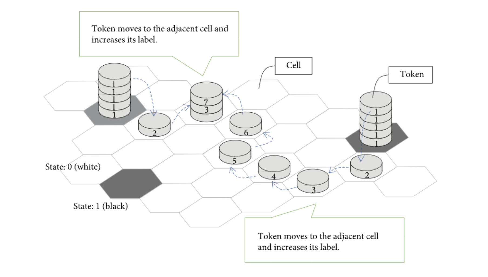

# Exploring Cellular Automata for Reaction-Diffusion Systems

Students: Ally Bell, Yehya Albakri

#

## Abstract

We plan on investigating the application of cellular automata in reaction-diffusion systems. Alan Turnng first described the behavior that produces the patterns appearing in reaction diffusion systems in his 1952 paper “The chemical basis of morphogenesis”. As summarized in Think Complexity, “these systems produce a wide range of patterns, depending on the diffusion and reaction rates, and [Turing] conjectured that systems like this might be an important mechanism in biological growth processes, particularly the development of animal coloration patterns.” We think that this will be an interesting avenue to explore in order to develop a better understanding of the modeling of growth behaviors found in nature. Especially coming from a simple model, we may be able to discover rules that yield similar behavior to natural phenomena. We plan on writing an implementation and extension for the algorithms in Python. Specifically, we believe it would be helpful to use the correlate2d function in numpy as a more efficient way to execute steps in our simulation.

#

## Annotated Bibliography

<ins>Emergence of Turing Patterns in a Simple Cellular Automata-Like Model via Exchange of Integer Values between Adjacent Cells</ins>

Ishida, Takeshi, Hindawi Discrete Dynamics in Nature and Society (January 28, 2020)

This paper presents a CA-like model of a simplified Turning pattern model which can produce the characteristic spots and stripes while also being able to support Turing instability. On a hexagonal grid, the model employs a different approach to pattern formation that uses  only one type of token. Cells exchange integer values with only adjacent cells, and tokens increase in value as they move. Some token movement is determined by the global algorithm rather than the local, differentiating the model from a typical CA structure. Ishida proposes the application of this model to IOT devices to control data traffic.

 

<ins>Class of Cellular Automata for Reaction-Diffusion Systems</ins>

Weimar, Jörg R.; Boon, Jean-Pierre, Physical Review (May 22, 1993) 49 1749-1752

The authors introduce a type of cellular automata to model reaction-diffusion systems in a quantitatively correct way, and verify it using the Ginzburg-Landau equation. This CA finds the moving average to implement diffusion, and a probabilistic lookup table to simulate the reaction. Unlike other CA models of reaction diffusion systems, which typically focus on qualitative rather than quantitative aspects of the system, this class preserves what they deem the most relevant quantitative features. 

#

## Experiments to Replicate and Results

Our plan is to start by replicating the model in the Ishida paper. This model is made up of a hexagonal grid, and passes integer values between local cells, while some behavior is dictated by the system-wide algorithm. This simulated space is visualized below.

Our model should yield results resembling Turing patterns. Below are several examples of what this looks like.

#

## Interpretation of Results

These results visualize the diffusion of one material through another. Some constants can define the addition and removal of each of the “chemicals” present and their diffusion rates. By changing the ratio of chemicals, diffusion rate, or reaction rate, we will see a range of patterns. Understanding the implications of different patterns may be challenging, and linking their behaviors to patterns in nature quantitatively we expect to be challenging. The authors of the paper in Physical Review do this using the Ginzburg-Landau equation, which we plan on exploring further.

#

## Next Steps

We plan on starting out by implementing a basic reaction-diffusion model in Python. Source code was not provided for the specific papers we are referencing, their algorithms are thoroughly explained, and we will already have a code base for reaction-diffusion systems. There are a range of ways we can build off this model once we have it running, and plan on further investigating extensions and their possible application to patterns found in nature. For example, we could use more than two chemicals or simulate the diffusion of multiple chemicals through a porous material.

#

## Links

https://www.researchgate.net/figure/Typical-Turing-patterns-of-N-in-model-4-with-parameters-b-0-25-g-0-50-d-1-0_fig2_231021430

https://www.researchgate.net/publication/13328696_Class_of_cellular_automata_for_reaction-diffusion_systems

https://www.hindawi.com/journals/ddns/2020/2308074/